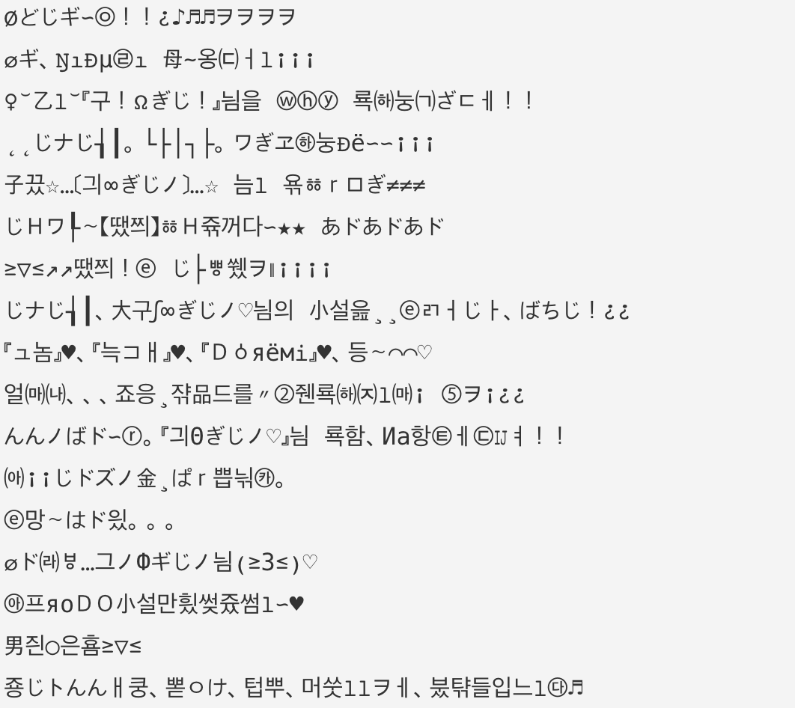
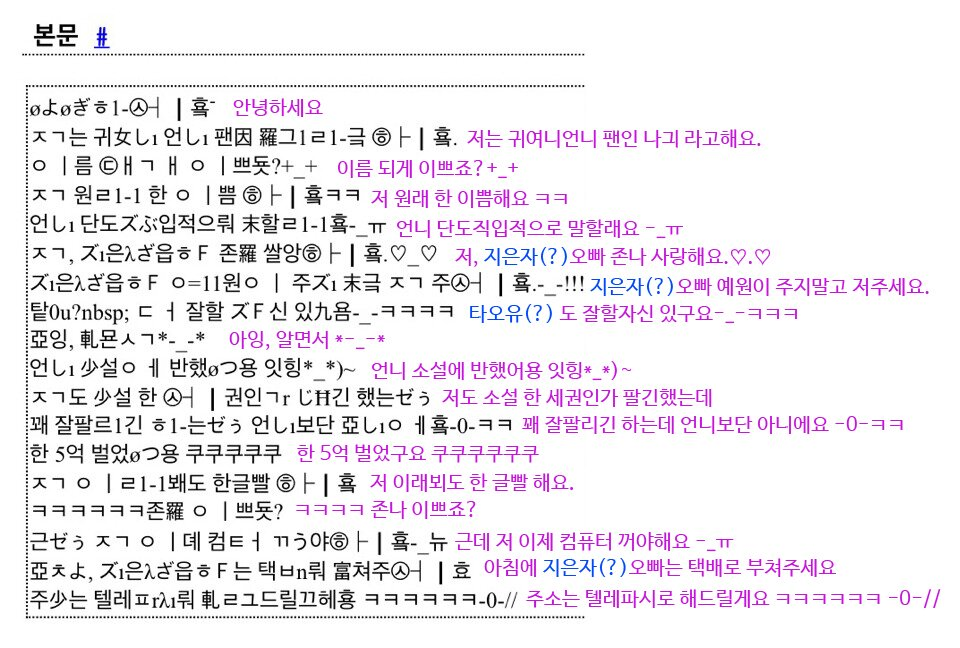
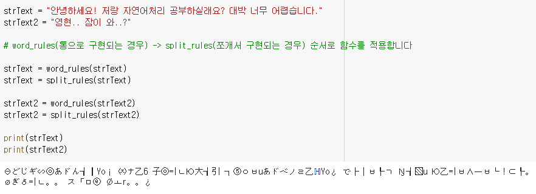

# 귀여니체 변환기

- 본 프로젝트는 서울과학기술대학교 컴퓨터공학과 4-1 수업인 '자연어처리'의 자유주제 프로젝트 용도로 만들어졌습니다. (2021.06.15)

## 목차
- [1. 귀여니체는 무엇인가?](#귀여니체는-무엇인가)
- [2. Challenge](#challenge)
- [3. 코드 적용 결과](#코드-적용-결과)
- [4. 참조 링크들](#참조-링크들)
---

# 귀여니체는 무엇인가

### 한 눈에 보는 귀여니체

- 한국인도 한 눈에 알아보기 힘든 외계어로 구성되어 있는 것이 큰 특징입니다

### 주제 선정 이유

- 지난 일은 항상 미화되기 때문에 사람들은 항상 과거를 추억하게 되고, 과거는 향수의 대상이 됩니다.
- 이 때, 개인의 과거를 넘어서 우리 모두의 과거인 '세대'에 대해서도 마찬가지입니다. 우리는 항상 ‘예전이 좋았다’ 며 **그 시절을 그리워하고, 그 시절의 문화에 열광하게 됩니다**.
- 그래서인지, 요즘 사람들에게 가장 인기를 끌고 있는 유튜브 콘텐츠 중 하나는 ‘피식대학’의 ‘05학번이즈백’ 입니다.
- 해당 콘텐츠는 2000년대 세대의 유행어와 패션, 핫플레이스 등 그 시절의 문화를 주제로 향수를 유발시키는 콘텐츠로 많은 사람들의 공감을 얻어내고 있습니다
- 저는 해당 콘텐츠에서 영감을 받게 되어 **사람들에게 재미를 주기 위한 목적**으로 2000년대 초의 유행어인 **'귀여니체' 변환기**를 계획하게 되었습니다.

---

# challenge

## 개발 전

- 공식이 없기 때문에 매력이 있는 귀여니체

    → 하나의 글자가 똑같은 글자로만 바뀌면 매력이 반감되므로 최대한 다양하게 변화될 수 있도록 하는것이 목표

    → **한 글자에 대해 바뀔 수 있는 다양한 데이터셋 후보 확보** 필요

- 한글 뿐 아니라 **한자나 여러 특수문자로 구성된 특성** **반영** 필요

## 개발 이후

- 개발의 틀이 된 오픈소스로, '[한국인만 알아볼 수 있는 리뷰 만들기](https://jinh0park.github.io/posts/2018/08/05/hangul.html)' 의 코드와 설명을 참고하였습니다 :-)
- 구현 방식의 큰 틀은 '[야민정음 번역기](https://github.com/joonahn/yamin.py/blob/master/yamin.py)'에서 영감을 얻었습니다

### 오픈소스와의 차이점

- **한글 변환 및 분해 방식의 차이**
    - '한국인만 알아볼 수 있는 리뷰 만들기'의 경우
        - 초성, 중성, 종성으로 분해한 후 중성만 변화시켜 다시 조합합니다
    - 해당 프로젝트의 경우
        - **초성, 중성, 종성 모두 귀여니체(외계어)변환이 필요**합니다.
        - 단, **외계어 변환 이후 재조합이 불가능하므로 퀄리티 향상을 위해** 1:1 변환만을 적용한 것이 아닌 **多:1 변환에도 주목**했습니다 (ex. 안녕 → Øどじギ∽㉧)
            1. **초성 + 중성 + (종성)의 조합(글자 하나가 통으로 변환되는 경우)**으로 만들어질 수 있는 **글자 변환 코드 구현**
            2. **중성 + 종성의 조합**으로 만들어지는 **글자 변환 코드 구현**
- **랜덤하게 여러 개의 데이터셋으로 변할 수 있는** 글자들
    - '한국인만 알아볼 수 있는 리뷰 만들기'의 경우
        - 한 중성 글자당 하나의 후보 존재
    - 해당 프로젝트의 경우
        - 변환 가능한 여러 데이터셋이 존재하는 경우, **여러개의 후보 중 랜덤하게 하나를 선택할 수 있도록 구현**

---

# 코드 적용 결과

`word_rules(통으로 구현되는 경우) -> split_rules(쪼개서 구현되는 경우) 순서로 함수를 적용합니다`

---

# 참조 링크들

### 귀여니체 변환 데이터셋

1. [1번 사이트](https://blog.naver.com/furlong49/221191482769)
2. [2번 사이트](https://steemit.com/kr/@twinbraid/6ax29p)
3. [3번 사이트](https://blog.naver.com/3345/220645089468)

### 개발

1. [한글 유니코드 방식](https://hanggoo.tistory.com/10)
2. [한국인만 알아볼 수 있는 리뷰 만들기](https://jinh0park.github.io/posts/2018/08/05/hangul.html) (github blog)
3. [야민정음 번역기](https://github.com/joonahn/yamin.py/blob/master/yamin.py) (github)
